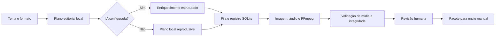
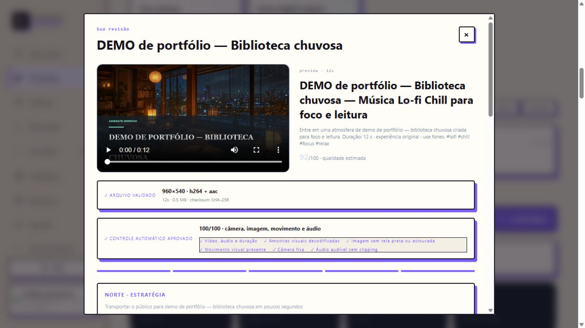

# Faceless Content Factory — IA aplicada à operação de conteúdo

**Yan Stutz · Case 02 · Auditoria e demonstração em 24/09/2026**

## O problema

Produzir conteúdo exige coordenar briefing, direção visual, texto, mídia, renderização, revisão e arquivos de entrega. Quando essas etapas ficam dispersas, torna-se difícil reproduzir uma produção, entender uma decisão e verificar o pacote antes de publicar.

## A solução construída

Um estúdio local em Python com interface web que transforma um tema em um plano editorial e um pacote de vídeo. O fluxo mantém artefatos de cada etapa, valida a mídia gerada e termina em revisão humana. O foco principal desta versão é vídeo de ambientação; ela não deve ser apresentada como um sistema já validado para venda de imóveis.

**[Código público](https://github.com/yanstutz33/faceless-content-factory) · [Versão auditada](https://github.com/yanstutz33/faceless-content-factory/tree/44a00c976a1aad4680f30c5df7dac23a11c49f8a)**

## Arquitetura e fluxo



| Camada | Implementação observada |
|---|---|
| Planejamento | Python; etapas de pesquisa, estratégia, roteiro, direção, SEO, conformidade, crítica e reaproveitamento |
| IA opcional | `factory/llm.py`: chamada à Responses API com saída JSON estruturada e retorno ao plano local em caso de erro |
| Persistência | SQLite: fila, estados de produção, eventos e métricas |
| Mídia | FFmpeg/FFprobe; vídeo H.264, áudio AAC, capas e relatórios |
| Interface | HTML, CSS e JavaScript; painel local servido pelo backend Python |
| Revisão | Conferência técnica, checksum e decisão humana antes da entrega |

## Onde entra IA — e onde entram regras

As etapas chamadas de “agentes” têm uma base determinística em `factory/agents.py`. O enriquecimento opcional por IA atua em palavras-chave, promessa, título, descrição e tags. Isso não significa que todas as etapas chamem modelos, nem que o sistema treine um modelo próprio.

A demonstração desta entrega rodou **sem credenciais de IA**, usando o plano local. Ela comprova o fluxo funcional e a geração de mídia. A integração externa foi inspecionada no código, mas não foi exercitada com uma chamada real nesta auditoria. As notas de qualidade mostradas na interface são critérios internos, não previsões comprovadas de alcance, retenção ou originalidade jurídica.

## Demonstração verificável

Foi criada uma produção isolada com o tema “DEMO de portfólio — Biblioteca chuvosa”, sem dados de campanhas ou contas conectadas.

- Vídeo de **12 segundos**, **960 × 540**, H.264/AAC, **527.589 bytes**.
- Estado final: `awaiting_approval` — aguardando revisão.
- Relatório de mídia: duração, vídeo e áudio aprovados pelo FFprobe.
- Nenhum upload realizado; métricas de audiência não foram preenchidas.
- **63 testes Python passaram**, sem testes ignorados, em 34,342 s no ambiente desta auditoria.



[Assistir/baixar a prévia de 12 segundos](evidencias/factory-demo.mp4) · [Relatório de mídia](evidencias/render-report.json) · [Plano editorial gerado](evidencias/agents.json)

Esta é uma prévia técnica curta, criada pelo caminho de preview interno do projeto. A interface/CLI de produção principal trabalha com vídeos de 30 ou 60 minutos. A prévia não comprova um ciclo de publicação de vídeo longo em plataforma.

## Impacto demonstrado

Uma execução coordenou plano, mídia e revisão e deixou arquivos inspecionáveis. Isso demonstra capacidade de transformar um processo editorial em software e criar pontos de controle para a automação.

Não há, nesta auditoria, medição de horas economizadas, custo por vídeo, receita, usuários ativos ou aumento de audiência. Não são reivindicados resultados comerciais nem prontidão de SaaS.

## Decisões e aprendizados

1. **Saída estruturada:** campos definidos tornam o enriquecimento da IA mais fácil de integrar e revisar.
2. **Continuidade local:** a operação básica continua disponível sem depender de uma resposta externa.
3. **Revisão separada da geração:** conseguir renderizar não significa que uma peça esteja editorialmente aprovada.
4. **Evidência antes de escala:** relatórios técnicos e testes comprovam funcionamento; métricas reais seriam necessárias para comprovar desempenho editorial.

## Relação com a vaga

O projeto evidencia organização de briefing, critérios de revisão e supervisão da automação. A aplicação proposta ao setor imobiliário seria adaptar a entrada para informações verificadas do imóvel e revisar ganchos, copys e roteiros contra objetivos e resultados reais. Essa adaptação ainda não foi implementada nem validada com uma operação imobiliária.

## Como experimentar

Requisitos: Python 3.11+ e FFmpeg/FFprobe disponíveis no PATH. Em um clone limpo, sem credenciais de plataformas:

```powershell
git clone https://github.com/yanstutz33/faceless-content-factory.git
cd faceless-content-factory
git checkout 44a00c976a1aad4680f30c5df7dac23a11c49f8a
python -m venv .venv
.\.venv\Scripts\python.exe -m pip install -r requirements.txt
.\.venv\Scripts\python.exe app.py serve
```

Abrir `http://127.0.0.1:8787`. A demonstração anexada permite avaliar a saída antes de instalar. Não é necessário conectar contas para explorar o painel local.

Para executar a suíte existente:

```powershell
.\.venv\Scripts\python.exe -m unittest discover -s tests
```

O primeiro teste nesta auditoria encontrou FFmpeg ausente no PATH; depois de configurá-lo, a suíte completa passou. Os números de validação de outras branches não foram transferidos para esta versão.
